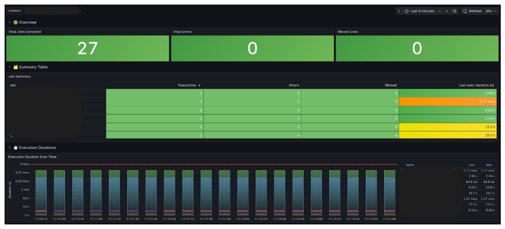

[](https://github.com/astral-sh/uv)
[](https://github.com/astral-sh/ruff)
[](https://mypy-lang.org/)

# APScheduler Exporter
A Prometheus exporter for APScheduler metrics

# Usage
## Basic Example
```python
from apscheduler_metrics import APSchedulerExporter

scheduler_exporter = APSchedulerExporter(scheduler=your_scheduler)
scheduler_exporter.start_http_server()
```
### Parameters : 
#### Disable metrics collecter for certain jobs
- Considered as private/dummy (with "_" prefix)
```python
from apscheduler.schedulers.background import BackgroundScheduler
from apscheduler_metrics import APSchedulerExporter

def task():
    pass

scheduler = BackgroundScheduler()

scheduler.add_job(task, 'interval', seconds=10, id='_your_task')

scheduler_exporter = APSchedulerExporter(scheduler=scheduler)
scheduler_exporter.start_http_server()
```
- By ids (explicitly)
```python
from apscheduler.schedulers.background import BackgroundScheduler
from apscheduler_metrics import APSchedulerExporter

def task():
    pass

scheduler = BackgroundScheduler()

scheduler.add_job(task, 'interval', seconds=10, id='your_task')

scheduler_exporter = APSchedulerExporter(scheduler=scheduler, excluded_jobs_by_id=['your_task'])
scheduler_exporter.start_http_server()
```


## Configuration
- port (default value: 8888)
- listen address (default value: '0.0.0.0')


# Metrics
Name     | Description                                       | Type
---------|---------------------------------------------------|----
apscheduler_job_done_total | Sent when a job is done.                          | Counter
apscheduler_job_errors_total | Sent when a job is failed.                        | Counter
apscheduler_job_missed_total | Sent when a job is missed.                        | Counter
apscheduler_job_last_duration_seconds | The runtime (seconds) for the last job execution. | Gauge

# Dashboard
See [Grafana Dashboard](https://github.com/cnfilms/apscheduler-exporter/blob/main/docs/grafana/dashboard.json) to import the example dashboard in your instance

